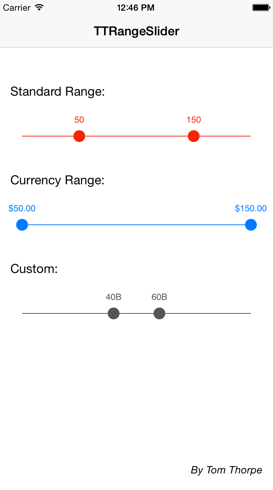

# TTRangeSlider
A slider, similar in style to UISlider, but which allows you to pick a minimum and maximum range.


## Installation

TTRangeSlider is available through [CocoaPods](http://cocoapods.org). To install
it, simply add the following line to your Podfile:

```ruby
pod "TTRangeSlider"
```

## Usage

Add the TTRangeSlider like you would with any other UIControl. Either:
* Add a view in your storyboard/class and change it’s type to `TTRangeSlider`. Then create an outlet to this in your code and use that to modify properties.
or
* Create the `TTRangeSlider` in code using `[TTRangeSlider alloc] init]` then add it as a subview to your code and set the relevant autolayout properties or frame.

Then, customisation of the control is done using the following properties:
* `tintColor`
The tintColor property (which you can also set in Interface Builder) sets the overall colour of the control, including the colour of the line, the two handles, and the labels.
It is safe to change the `tintColor` at any time, if the control is currently visible the colour change will be animated into the new colour.
* `minValue`
The minimum possible value to select in the range
* `maxValue`
The maximum possible value to select in the range
* `selectedMinimum`
The preselected minumum value (note: This should be less than the selectedMaximum)
* `selectedMaximum`
The preselected maximum value (note: This should be greater than the selectedMinimum)
* `numberFormatterOverride`
Each handle in the slider has a label above it showing the current selected value. By default, this is displayed as a decimal format.
You can override this default here by supplying your own NSNumberFormatter. For example, you could supply an NSNumberFormatter that has a currency style, or a prefix or suffix.
If this property is nil, the default decimal format will be used. Note: If you want no labels at all, set this value to be `(NSNumberFormatter *)[NSNull null]` (as opposed to nil), to specifically mark that you want no labels
* `minLabelColour`
The colour of the minimum value text label. If not set, the default is the tintColor.
* `maxLabelColour`
The colour of the maximum value text label. If not set, the default is the tintColor.
* `disableRange`
If true, the control will mimic a normal slider and have only one handle rather than a range.
In this case, the selectedMinValue will be not functional anymore. Use selectedMaxValue instead to determine the value the user has selected.

## Author

Tom Thorpe

## License

TTRangeSlider is available under the MIT license. See the LICENSE file for more info.
